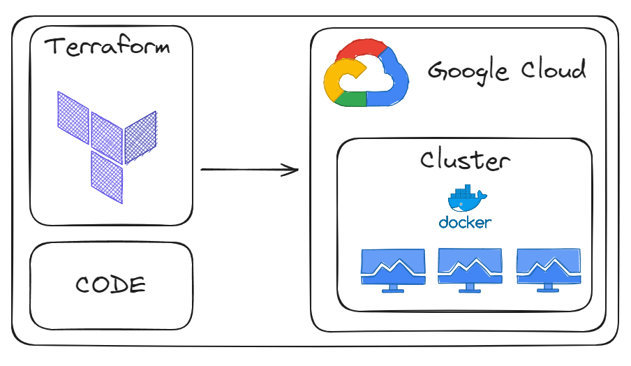
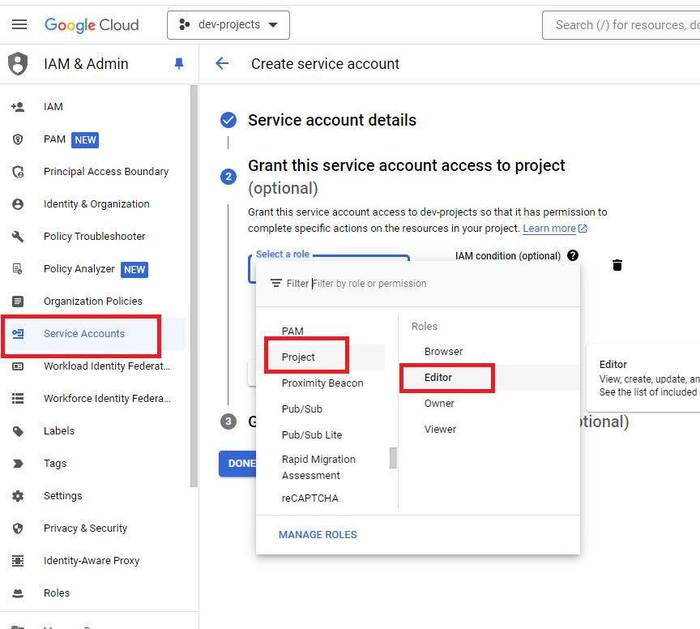
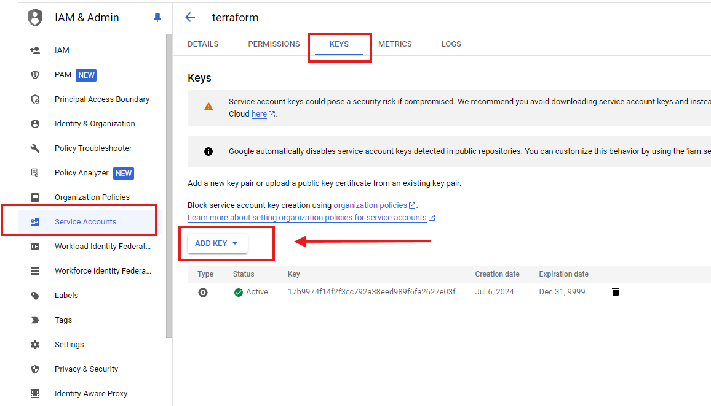
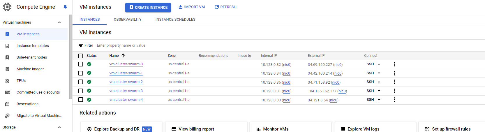
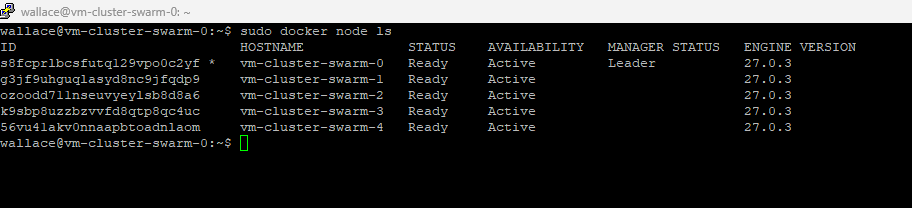
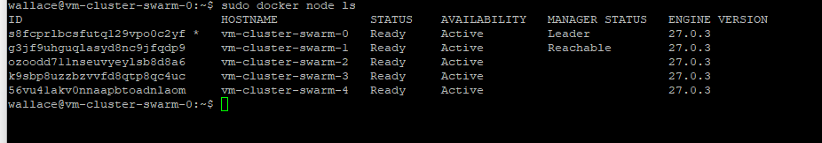

# Create Cluster with Terraform

Criando um cluster na GCP, de 5 máquinas já com o Docker instalado, utilizando o Terraform.

# Arquitetura


## Pré-requisitos
* Conta na GCP
* Service account 
* Terraform

## Como instalar Pré-requisitos?

### Criar conta na Google Cloud
Entre no site e crie a conta:
https://cloud.google.com/

### Service Account
Crie um service account com os seguintes requisitos:

```projeto/editor```

Sample:


Depois de criar o service account, basta exportar no formato json. 

sample:


------

⚠️Warning

Essa credencial tem permissão de criar qualquer recurso na GCP, por isso tem que ter muito cuidado com ela!

------

### Instalação do Terraform
Entre no site e siga o passo a passo, de acordo com o seu sistema operacional: 
https://developer.hashicorp.com/terraform/tutorials/aws-get-started/install-cli


## Configs do Cluster

O projeto consiste em criar um cluster na GCP com o Docker instalado para que possamos utilizar o Docker Swarm.

Configurações utilizadas na criação do cluster:

- Número de máquinas: 5
- Memória ram: cada máquina com 4gb : total 20gb

- Tipo de máquinas: n1-standard-1
- Sistema operacional: Ubuntu
- Disco: cada máquina com 20gb: total 100gb
- IP estático no node master


## Commands
### Inicializar o Terraform
```
terraform init
```

### Verificar o plano 
```
terraform validate
```

### Aplicar configurações 
``` 
terraform apply
```
sample cluster running:


### Destruir recursos    
```
terraform destroy
```

## References
https://developer.hashicorp.com/terraform/tutorials/gcp-get-started/google-cloud-platform-build

## Start Docker Swarm
## Steps
Entre na máquina que será a maquina master e execute o comando abaixo:
```
docker swarm init
```
O comando acima irá gerar um token.

## Adicionar nodes no cluster

basta copiar o token gerado pelo master e colar nos outros nodes.

## Listar nodes
```
sudo docker nodes ls
```
sample nodes running:


## Promover backup do master
```
sudo docker node promote vm-cluster-swarm-1
```


## Conclusão
Parabéns! você já tem um cluster criado na GCP e pronto para o uso do Docker Swarm. 

## Developer
| Desenvolvedor      | LinkedIn                                   | Email                        | Portfólio                              |
|--------------------|--------------------------------------------|------------------------------|----------------------------------------|
| Wallace Camargo    | [LinkedIn](https://www.linkedin.com/in/wallace-camargo-35b615171/) | wallacecpdg@gmail.com        | [Portfólio](https://wlcamargo.github.io/)   |